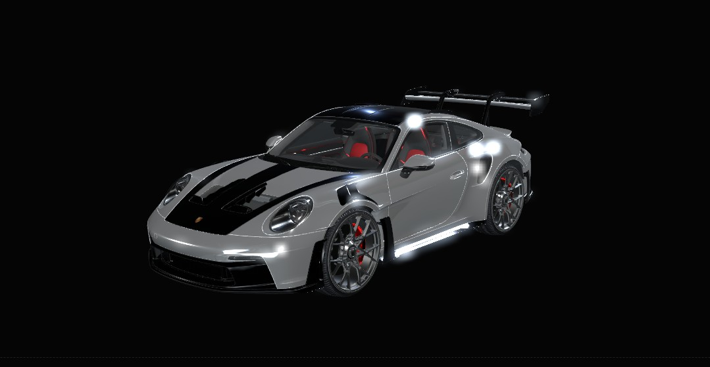

# Porsche Portfolio

Portfolio interactivo de Guillermo Sánchez: un recorrido 3D por mi stack de desarrollo, desde backend e IoT hasta frontend e inteligencia artificial.



## Stack técnico

- **Next.js** — estructura de aplicación, metadata SEO y convenciones de rutas.
- **TypeScript** — tipado estático para mantener la aplicación segura y mantenible.
- **React Three Fiber** — integración declarativa de Three.js con React para el recorrido 3D.
- **drei** — helpers y componentes listos para iluminación, entorno y carga del modelo.
- **GSAP + ScrollTrigger** — sincronización precisa de las animaciones con el desplazamiento.
- **Lenis** — scroll suave y consistente entre dispositivos.
- **Zustand** — estado ligero y centralizado para `scrollProgress` y calidad de renderizado.

## Arquitectura del scroll

`lib/scrollPhases.ts` es la fuente única de verdad para los rangos de cada fase del recorrido. La cámara, el modelo y el texto se calculan como funciones continuas de `scrollProgress`, en lugar de depender de animaciones disparadas por eventos aislados. Así, cualquier posición del scroll puede reconstruirse de forma determinista y el recorrido permanece sincronizado. Las secciones HTML posteriores se liberan cuando termina el track 3D.

## Cómo correrlo en local

```bash
git clone <url-del-repositorio>
cd <directorio-del-proyecto>
npm install
npm run dev
```

Abre [http://localhost:3000](http://localhost:3000). El repositorio incluye `public/cv.pdf` y `public/og-image.jpg`; si trabajas con una copia que no los contiene, coloca esos archivos manualmente en esas rutas antes de iniciar la aplicación.

## Créditos y licencias

- Modelo 3D **“Porsche GT3 RS”** por [Black Snow](https://sketchfab.com/BlackSnow02), bajo licencia [CC-BY-4.0](https://creativecommons.org/licenses/by/4.0/). Fuente original: [Porsche GT3 RS en Sketchfab](https://sketchfab.com/3d-models/porsche-gt3-rs-e738eae819c34d19a31dd066c45e0f3d).
- Las fuentes **JetBrains Mono** y **Space Grotesk** se cargan desde Google Fonts mediante `next/font` y permanecen sujetas a sus respectivas licencias de distribución.
- El resto del código de este proyecto es propiedad de su autor, salvo las dependencias de terceros indicadas por sus propios avisos de licencia.

## Autor

**Guillermo Sánchez Gutiérrez**

- [LinkedIn](https://www.linkedin.com/in/guillermo-sanchez-gutierrez/)
- [GitHub](https://github.com/grilletee)
